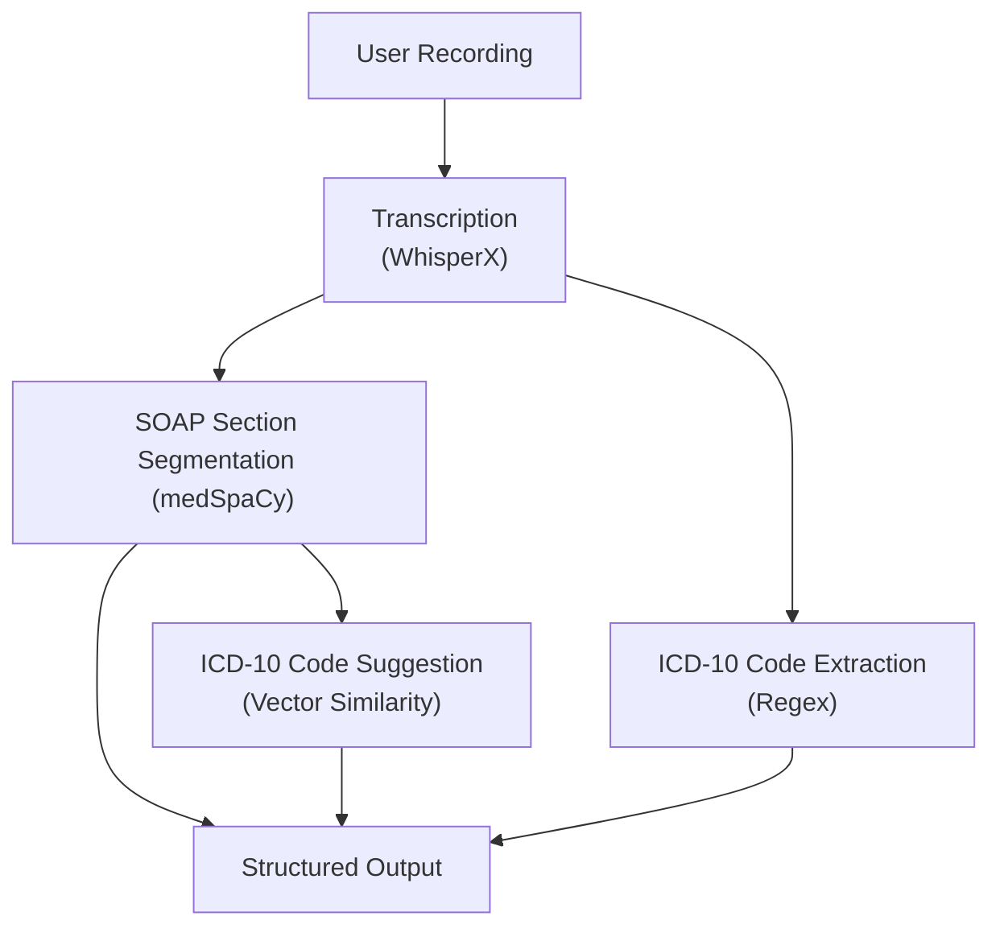

# Med Coder

[](https://choosealicense.com/licenses/mit/)


**Med Coder** is a Python-based pipeline that automates medical coding by transcribing audio SOAP notes, segmenting them into clinically relevant sections, and suggesting ICD-10 codes using both rule-based and NLP techniques. It uses [**WhisperX**](https://github.com/m-bain/whisperx) for transcription, [**medspaCy**](https://github.com/medspacy/medspacy) for SOAP section segmentation, and includes a Flask endpoint to streamline medical coding from clinical recordings.

## Pipeline Overview

The pipeline consists of the following stages:

1. **Audio Transcription**: Converts audio SOAP notes into text using WhisperX.
2. **SOAP Section Segmentation**: Splits the transcribed text into structured SOAP sections (Subjective, Objective, Assessment, Plan, etc.) using medspaCy.
3. **ICD-10 Code Extraction**: Uses regex to find and validate ICD-10 codes explicitly mentioned in the text.
4. **ICD-10 Code Suggestion**: Suggests ICD-10 codes by comparing clinical text embeddings to ICD-10 code descriptions using TF-IDF and cosine similarity.



Example output structure:

```json
{
  "soap_sections": [
    { "category": "history_of_present_illness", "text": "..." },
    { "category": "assessment_and_plan", "text": "..." }
  ],
  "extracted_icd10_codes": [{ "code": "R0602", "description": "Shortness of breath" }],
  "suggested_icd10_codes": [
    { "code": "R0600", "description": "Dyspnea, unspecified" },
    { "code": "J441", "description": "Chronic obstructive pulmonary disease, unspecified" }
  ]
}
```
